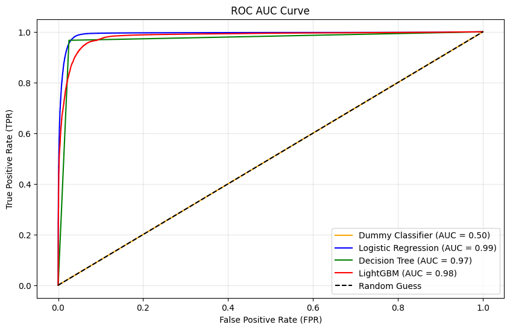
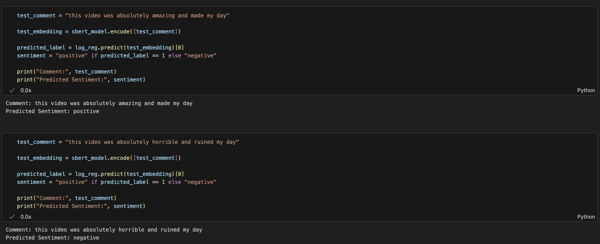

# YouTube Sentiment Analysis

This project explores the relationship between YouTube comment sentiment and engagement metrics like the like/dislike ratio. The goal is to understand how viewers actually feel about videos by analyzing their comments and comparing them to how they interact through likes and dislikes.

We started by labeling sentiment using a basic tool called TextBlob, which looks for positive or negative words. Later, we trained a custom machine learning model to better capture the tone of comments using real patterns in the text. The project includes data exploration, visualizations, and comparisons between sentiment and viewer engagement.

---

## 📁 Project Structure

- `notebooks/` – Step-by-step Jupyter notebooks showing analysis, sentiment labeling, and modeling.
- `datasets/` – Contains the full YouTube dataset (`USvideos.csv`, `UScomments.csv`). These files are too large to preview on GitHub, but they load fine locally.
- `requirements.txt` – List of Python packages used in the project.

---

## 🛠️ Setup Instructions (Mac/Linux/Windows)

### 1. Clone the repository

```bash
git clone https://github.com/your-username/youtube_sentiment_analysis.git
cd youtube_sentiment_analysis
```

### 2. Create and activate a virtual environment

**Mac/Linux:**

```bash
python3 -m venv sentiment_venv
source sentiment_venv/bin/activate
```

**Windows:**

```bash
python -m venv sentiment_venv
.\sentiment_venv\Scripts\activate
```

### 3. Install required dependencies

```bash
pip install -r requirements.txt
```

### 4. Launch Jupyter Notebook (optional)

```bash
jupyter notebook
```

---

## 📓 Notebooks Overview

- `eda_analysis_eli.ipynb` – Focused on modeling and getting a correct sentiment response for individual comments.
- `eda_analysis_fonz.ipynb` – Focused on testing multiple models to find the most accurate one for our project.
- `eda_analysis_jeel.ipynb` – Ran multiple hypothesis tests, including checking the correlation between sentiment and engagement.
- `eda_analysis_laura.ipynb` – Continued work on feature engineering and summary statistics.
- `eda_sda_analysis_jeel.ipynb` – Added statistical data analysis with labeled graphs to interpret key findings.

---

## 🔍 What We Found Out

Throughout the project, we explored how YouTube comments reflect viewer sentiment and how that compares to public engagement metrics like likes and dislikes. We began with TextBlob to label sentiment, but later upgraded to a more accurate machine learning pipeline using MiniLM sentence embeddings and a logistic regression classifier.

Here are the key findings:

- Many videos show a **clear mismatch between comment sentiment and like/dislike ratios**, suggesting that user engagement alone doesn’t reflect audience opinion.
- Users often leave **highly negative comments on videos with overwhelmingly positive engagement**, which highlights how comments can reveal hidden discontent or controversy.
- Our final sentiment model using **MiniLM + Logistic Regression** predicted individual comment sentiment with strong accuracy — up to **0.99** on large datasets and **0.80+** on smaller video samples with the help of embeddings.
- The **TextBlob** model helped generate initial sentiment labels quickly, but it struggled with sarcasm, informal language, or subtle tone shifts. Our custom model handled these much better.
- We also built a function to test individual comments from real videos, giving us a powerful tool to assess sentiment at a **comment-by-comment level**.
- By generating a **comment sentiment ratio** per video, we were able to compare it directly with like/dislike data — and found that the correlation between them remains **weak (around 0.28)**.

Overall, sentiment analysis gives us a much deeper and more nuanced view of audience feedback than engagement metrics alone.

---

## 📊 Sample Visualizations

To support our findings, here are some examples of visual sentiment patterns pulled directly from our exploratory notebooks.

### 🔹 Model Comparison (From Fonz's Notebook)



This chart compares different machine learning models tested for accuracy on predicting comment sentiment. It helped us decide to move forward with MiniLM + Logistic Regression.

### 🔹 Sentiment Breakdown per Video (From Eli's Notebook)



This visualization highlights how sentiment varies across individual videos, even when engagement ratios appear positive.
